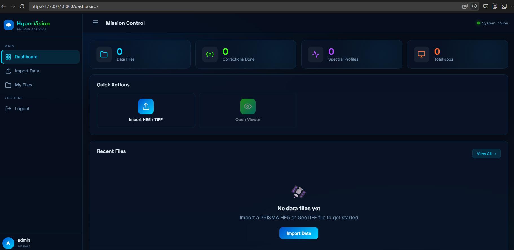
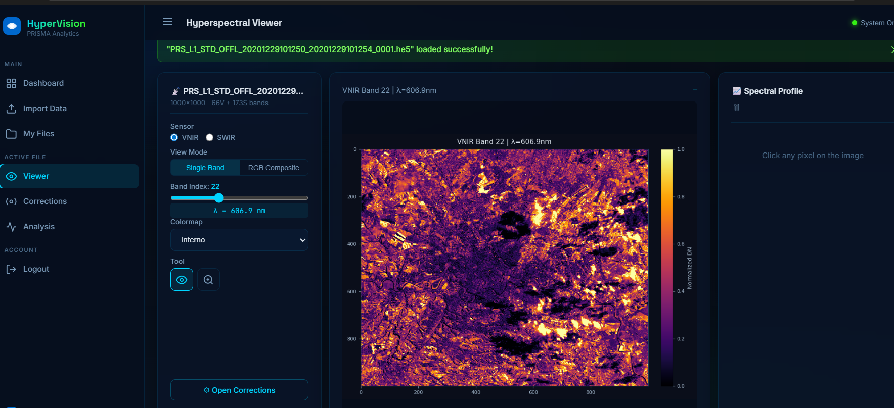
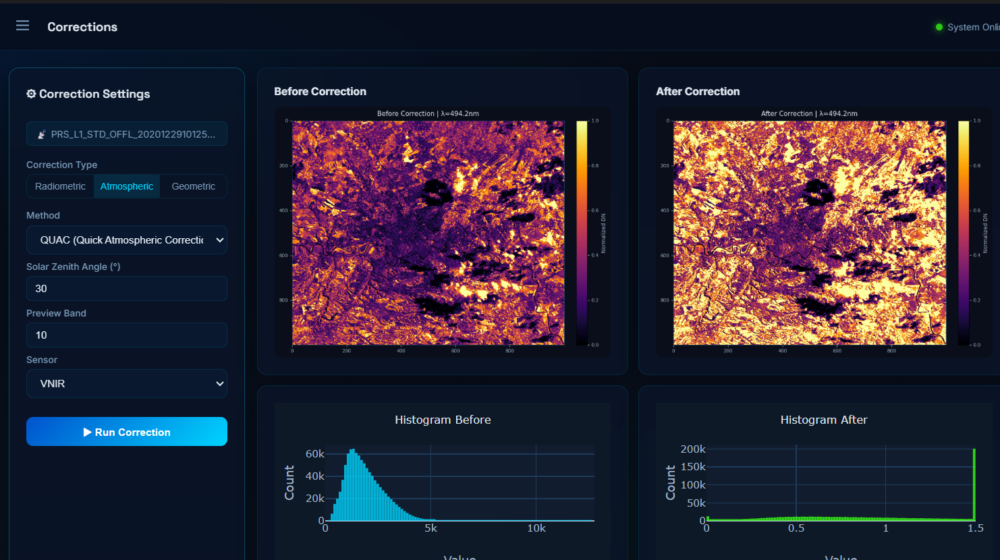
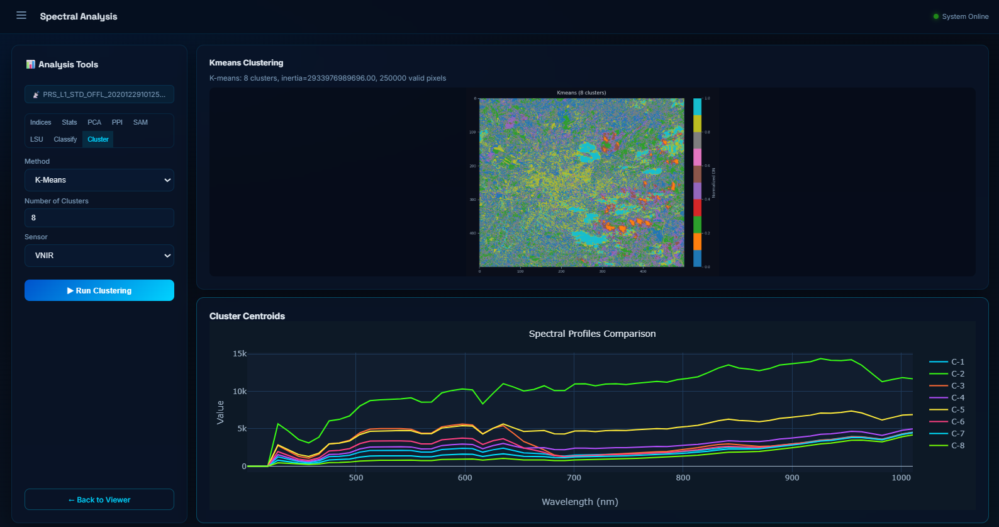

# 🛰️ HyperVision: Advanced Hyperspectral Image Processing & Visualization Platform

**HyperVision** is a comprehensive, web-based platform built on Django for the ingestion, visualization, correction, and advanced analysis of hyperspectral imaging (HSI) data. Specially designed to support satellite sensor datasets (such as **PRISMA HE5**), **ENVI HDR/IMG**, and **GeoTIFF** cubes, HyperVision bridges the gap between scientific Python algorithms and an intuitive, interactive user interface.

---

## 📸 Project Showcase

Below are placeholders to showcase the active screens of HyperVision.

### 1. Dashboard Overview
> *The central hub showing system statistics, active jobs, saved spectral profiles, and recently uploaded files.*



### 2. Interactive Spectral Cube Viewer
> *A dark-themed, premium viewer that displays grayscale bands and false-color RGB composites. Users can click any pixel to instantly plot its spectral reflectance curve across VNIR/SWIR wavelengths.*



### 3. Radiometric & Atmospheric Corrections
> *The corrections panel displaying a "Before vs. After" comparison side-by-side with corresponding histograms, tracking the execution logs of corrections.*



### 4. Advanced Analysis and Machine Learning
> *The analysis dashboard displaying PCA Explained Variance, Pixel Purity Index (PPI) Endmember profiles, Spectral Angle Mapper (SAM) target classification maps, and supervised machine learning metrics.*


---

## 🚀 Key Features

### 📡 1. Multi-Format Cube Loader
*   **PRISMA Satellite (HE5):** Automatically parses high-resolution VNIR (66 bands) and SWIR (174 bands) hyperspectral bands, including full calibration metadata and wavelength lookup tables.
*   **ENVI HDR/IMG:** Seamlessly reads raw binary raster cubes along with their corresponding ASCII headers.
*   **GeoTIFF:** Standard multi-band TIFF reader mapping geotransforms, coordinate systems (CRS), and band channels.

### 🔬 2. Spectral Analysis Engine
*   **Spectral Profiler:** Interactive pixel-level spectral signature extraction. Save custom signatures (vegetation, soil, water, minerals) to the database and plot comparisons on a unified chart.
*   **Spectral Indices:** Compute standard and custom indices dynamically:
    *   *NDVI* (Normalized Difference Vegetation Index)
    *   *EVI* (Enhanced Vegetation Index)
    *   *NDWI* (Normalized Difference Water Index)
    *   *SAVI* (Soil Adjusted Vegetation Index)
    *   *NDMI* (Normalized Difference Moisture Index)
    *   *NBR* (Normalized Burn Ratio)
    *   *Custom* two-band math (ratio, difference, normalized difference).

### 🛠️ 3. Physical & Sensor Corrections
*   **Radiometric:** Dark current removal, PRNU (pixel response non-uniformity) normalization, pushbroom smear removal, smile effect correction (spectral interpolation), and keystone shift correction.
*   **Atmospheric:** Dark Object Subtraction (DOS), Empirical Line calibration, QUAC (Quick Atmospheric Correction), and a simplified 6S radiative transfer model simulation.
*   **Geometric:** GCP (Ground Control Point) polynomial warping, affine transformation adjustments (rotation, scale, shift), and orthorectification using a proxy DEM gradient.

### 🧠 4. Machine Learning & Dimensionality Reduction
*   **Dimensionality Reduction:** Principal Component Analysis (PCA) with components visualization and a cumulative variance chart.
*   **Endmember Extraction:** Pixel Purity Index (PPI) extrema-projections to find pure pixels, grouped into target classes using K-Means.
*   **Target Detection & Classification:** Spectral Angle Mapper (SAM) to map spectral distance. Linear Spectral Unmixing (LSU) via Non-Negative Least Squares (NNLS) to compute sub-pixel abundance fractions.
*   **Supervised/Unsupervised ML:** Random Forest and Support Vector Machine (SVM) training for pixel-level material classification, along with unsupervised K-Means and Spectral Clustering.

---

## 📂 Project Architecture

The codebase is modularly designed, separating the Django application framework from the core scientific HSI utilities.

```
hyperspectral/
├── core/                        # Django Application Layer
│   ├── models.py                # Database models for DataFile, ProcessingJob, SpectralProfile
│   ├── views.py                 # Core routing, dashboard logic, and JSON API endpoints
│   ├── urls.py                  # API endpoints and page route mappings
│   ├── templates/               # UI templates (dashboard, viewer, corrections, analysis, login)
│   └── utils/                   # Scientific Processing & Math Layer
│       ├── he5_reader.py        # Custom file loaders for HE5 and ENVI raster formats
│       ├── corrections.py       # Math algorithms for radiometric, atmospheric, and geometric corrections
│       ├── indices.py           # Functions computing standard and custom HSI indices
│       ├── analysis.py          # Machine learning algorithms (PCA, SAM, PPI, LSU, SVM, Random Forest)
│       └── visualization.py     # Base64 PNG imagery and Plotly.js chart generator
├── data/                        # Directory for raw hyperspectral datasets (HE5, TIFF, HDR)
├── static/                      # Static assets (stylesheets, icons, JavaScript)
├── manage.py                    # Django administration script
├── requirements.txt             # Python packages and environment specifications
└── project.ipynb                # Jupyter Notebook with exploratory analysis and prototyping
```

---

## 🛠️ Installation & Setup

Follow these steps to get HyperVision running locally on your machine:

### 1. Prerequisites
Make sure you have **Python 3.10+** installed. You will also need C-libraries for geospatial packages if installing on bare metal (though standard wheels are generally available for common OS platforms).

### 2. Clone the Repository & Setup Environment
```bash
# Clone this repository (or navigate to the project directory)
cd hyperspectral

# Create a virtual environment
python -m venv hypenv

# Activate the virtual environment
# On Windows (Command Prompt):
hypenv\Scripts\activate
# On Windows (PowerShell):
.\hypenv\Scripts\activate.ps1
# On macOS/Linux:
source hypenv/bin/activate
```

### 3. Install Dependencies
```bash
# Upgrade pip to the latest version
pip install --upgrade pip

# Install required python packages
pip install -r requirements.txt
```

### 4. Database Setup & Migrations
HyperVision uses SQLite by default for simplicity.
```bash
# Apply database migrations to create tables
python manage.py migrate

# Create an administrator account to login
python manage.py createsuperuser
```

### 5. Running the Application
```bash
# Start the local development server
python manage.py runserver
```
Once started, navigate to **`http://127.0.0.1:8000/`** in your web browser. Login using the superuser credentials created in step 4.

---


